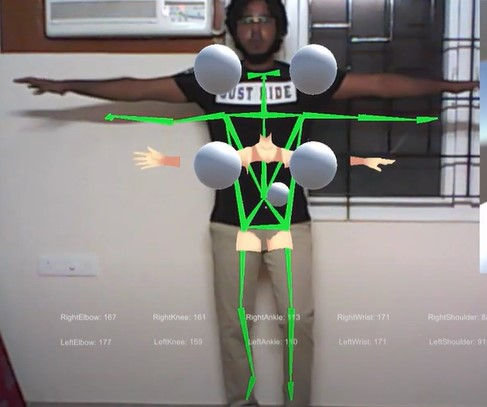

# Real-Time Rehabilitation Treatment System

## Overview
This project implements a real-time rehabilitation treatment system that utilizes advanced image processing techniques and machine learning models to monitor and analyze the movements of disabled people. The system is designed to assist in physical therapy by detecting human poses from a video feed, leveraging GPU-accelerated computations to handle complex image transformations and pose estimation in real-time. Additionally, the system supports functionalities for uploading images to a cloud service and sending notifications about significant events or statuses, enhancing the monitoring and treatment process.

## Features
- **Real-Time Pose Detection**: Monitors and detects human poses in real-time, providing immediate feedback for rehabilitation exercises.
- **Rehabilitation Assistance**: Specifically tailored to assist disabled people by analyzing their movements to suggest improvements or alert medical personnel.
- **Image Processing**: Utilizes advanced algorithms to resize, pad, and normalize video frames for input into pose detection models.
- **GPU Acceleration**: Employs GPU processing to enhance the speed and efficiency of image processing and pose detection tasks.
- **Image Uploads**: Supports uploading detected images to a cloud storage solution, allowing for remote access, review, and further analysis by healthcare providers.
- **Notifications**: Sends messages or alerts based on detected poses or predefined conditions, facilitating real-time monitoring and response from medical teams.

## Results
- **Improved Patient Monitoring**: Real-time feedback helps patients perform exercises correctly, enhancing the effectiveness of rehabilitation.
- **Enhanced Remote Supervision**: Healthcare providers can remotely monitor patient progress through uploaded images and alerts.
- **Efficient Data Handling**: GPU acceleration ensures that image processing and pose detection are performed quickly and efficiently, making the system suitable for real-time applications.
- **Comprehensive Reports**: Automated alerts and notifications ensure that significant events are promptly reported, facilitating timely interventions.
<p align="center">
  
</p>


## System Requirements
- Python 3.6 or higher
- OpenCV-Python
- NumPy
- SciPy
- A GPU that supports CUDA (for `aidlite_gpu` functionality)
- Android device for notifications (optional)

## Installation
1. **Clone the repository**:
   ```bash
   git clone https://github.com/yourusername/real-time-rehabilitation-system.git
   cd real-time-rehabilitation-system
   ```

2. **Install dependencies**:
   ```bash
   pip install numpy opencv-python scipy
   ```

3. **Hardware setup**:
   - Ensure that a compatible GPU is installed and properly configured on your system.
   - Connect a compatible camera to your system for capturing video feeds.

4. **Configure cloud storage and notifications**:
   - Set up an account with a AWS cloud storage provider and obtain necessary API keys and credentials.
   - Configure the messaging or notification service with the appropriate API keys and endpoints.

## Usage
1. **Run the main application**:
   ```bash
   python remote_rehabilitation.py
   ```
   This will start the video capture and pose detection process. Detected poses will be displayed in real-time in a window.

2. **Interact with the system**:
   - The application will automatically upload images to the configured AWS S3 storage and send notifications based on detected poses.
   - Press 'q' to quit the application and close the video feed.

## Configuration
- Modify `config.py` (create this file in the main directory) to change settings such as storage paths and API keys for AWS.

## Contributing
Contributions to the project are welcome! Please fork the repository and submit pull requests with your proposed changes. For major changes, please open an issue first to discuss what you would like to change.

## License
Distributed under the MIT License. See `LICENSE` for more information.

## Contact
- Your Name - isabeljohnson001@gmail.com
- Project Link: https://github.com/yourusername/real-time-rehabilitation-system
